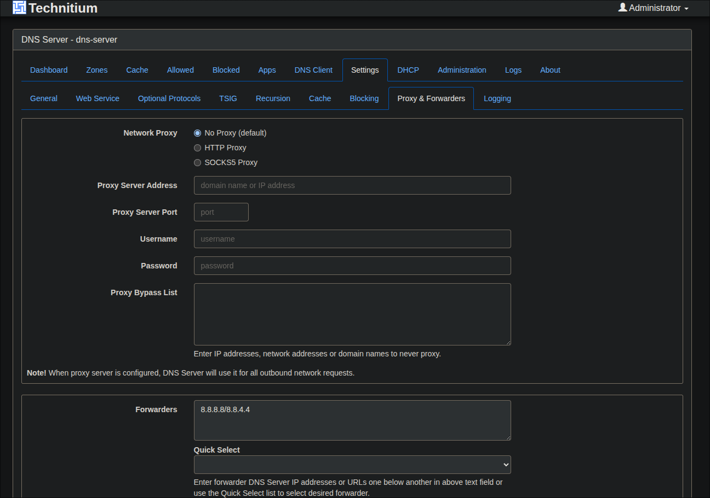
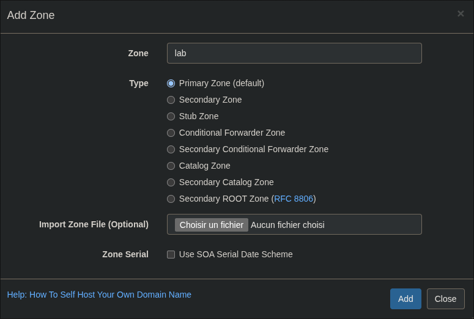
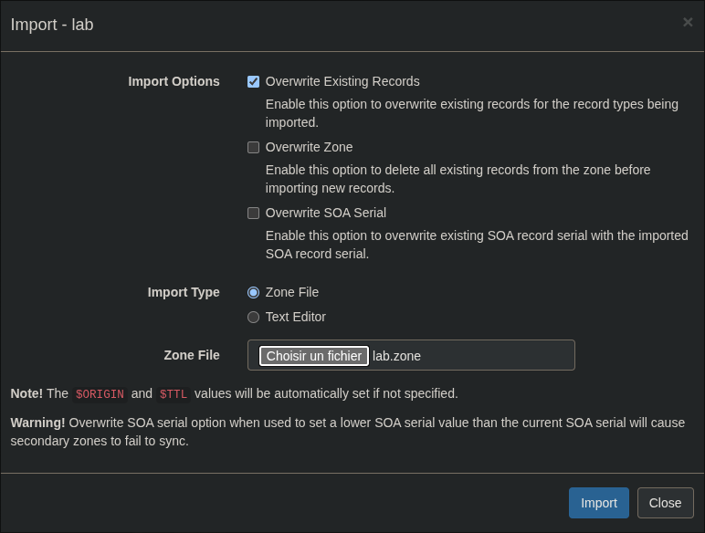
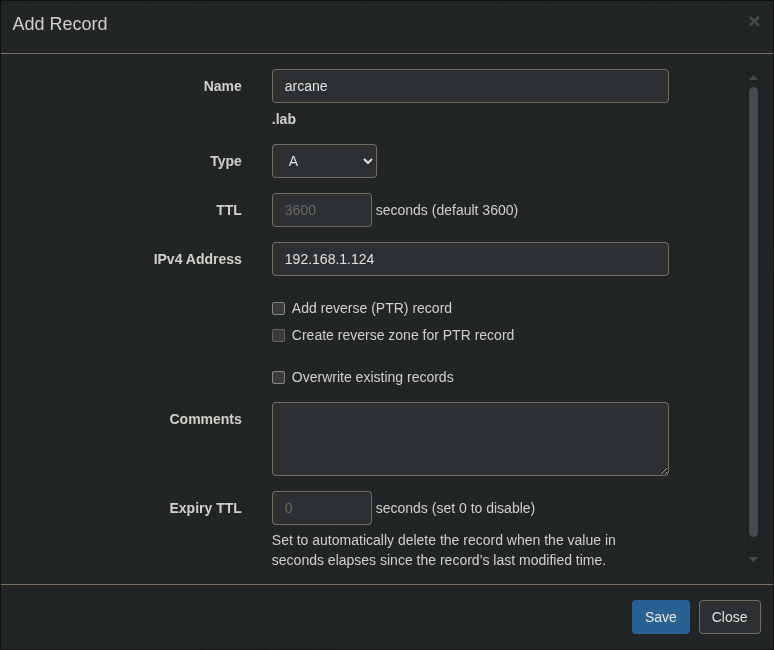

# Technitium

## Pré-requis

- Sur le serveur qui héberge Traefik, l'adresse IP doit être statique ou réservée via le DHCP.
- Sur chaque client devant atteindre les containers, l'IP du serveur hébergeant Technitium doit être renseignée comme DNS principal.

## Paramétrage

Technitium est un DNS self-hosted : dans ce lab, il sert à ne pas avoir à modifier votre `/etc/hosts`, et à résoudre les noms de domaine en IP (arcane.lab, heimdall.lab, etc.).  

Une fois le container déployé, allez sur : http://localhost:5380/  

Il faut commencer par configurer un ou plusieurs Forwarder(s) pour rediriger le trafic inconnu vers un DNS public. Allez sur "Settings" puis "Proxy & Forwarders", et configurez par exemple : `8.8.8.8/8.8.4.4`  

  

Il faut ensuite créer une zone : allez sur "Zones" puis cliquez sur "Add Zone".  

  

Allez ensuite sur votre nouvelle zone créée (si cela n'est pas fait automatiquement par Technitium) pour créer des enregistrements A (DNS A record).  

On peut importer en masse des enregistrements A en cliquant sur "Options" puis "Import" → choisissez ensuite le fichier "lab.zone" (⚠️ ATTENTION, révisez les IP renseignées dans ce fichier).  
> Les IP doivent correspondre à l'endroit où tourne votre Traefik (⚠️ ne pas mettre 127.0.0.1)

  

Vous pouvez aussi saisir les hôtes A à la main (un par un) en cliquant sur "Add Record".  

  

> [!CAUTION]
> Attention à faire en sorte que l'IP renseignée pour les Hôtes A ne change pas, soit :
> - en mettant votre équipement en IP statique
> - en faisant une réservation d'IP via votre DHCP

Le but maintenant est de passer par notre DNS self-hosted : il faut donc définir Technitium comme DNS principal, avec un DNS secondaire en secours.  

Par exemple :
```
192.168.1.124,8.8.8.8
```

Relancez votre connexion réseau.  

Vous pouvez ensuite vérifier que vos DNS sont corrects avec :
```bash
nmcli device show | grep IP4.DNS
# ou
cat /etc/resolv.conf
```

Si vous avez modifié votre `/etc/hosts`, vous pouvez maintenant commenter ou supprimer les lignes comme :
```
127.0.0.1   convertx.lab
127.0.0.1   dozzle.lab
```

Une fois cela fait ouvrez votre navigateur préféré en privée (pour ne pas avoir de cache) et testé si les noms de comaine .lab fonctionnent :
http://arcane.lab   
http://heimdall.lab   
http://technitium.lab   
...  

⚠️ Il y a une subtilité avec "sqlitebrowser.lab" (https://sqlitebrowser.lab:3051/) et "traefik.lab" (http://traefik.lab:8081/)  